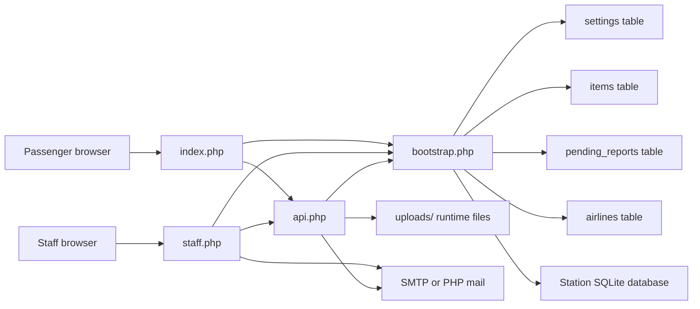
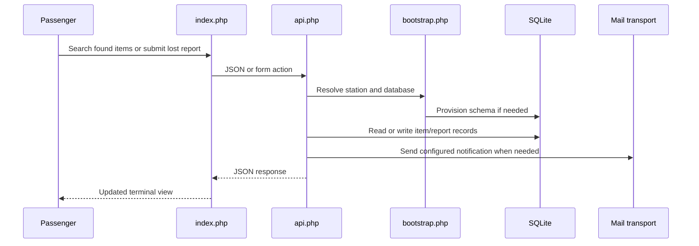
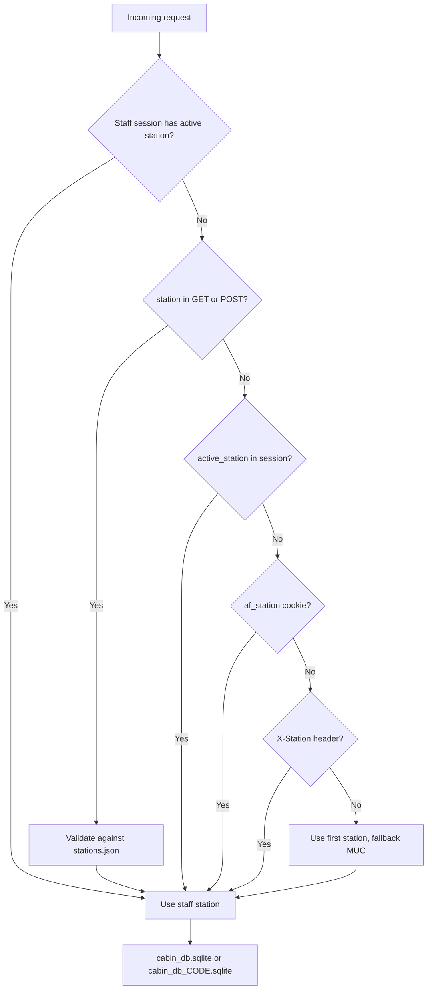
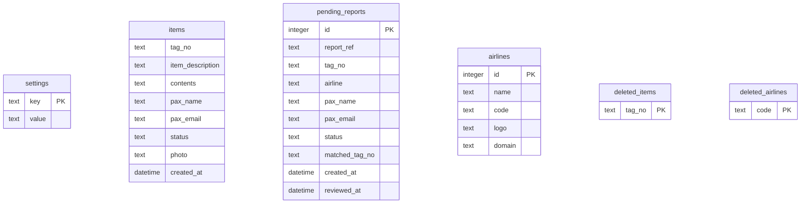

# Architecture

## Application Components

## Request Flow

## Station Resolution

## Data Model

## Runtime Files

- `cabin_db.sqlite` and `cabin_db_CODE.sqlite` are generated locally and ignored by Git.
- `uploads/` stores runtime uploads and local email copies.
- `release/` stores generated release builds and is ignored by Git.
- `uploads/.htaccess` is tracked because it blocks script execution inside uploads.
