# Git Workflow & Automated Deployment

This guide outlines the Git workflow, repository hygiene, and the GitHub-integrated automated deployment process for the AeroFind Cabin Portal.

---

## 1. Branching Strategy & Contribution Workflow

To maintain absolute codebase stability, team members must adhere to the following workflow:

```mermaid
flowchart TD
    subgraph Git ["1. Git Contribution Lifecycle"]
        M1["main branch"] -->|"git checkout -b feat/branch"| B1["feat/branch (Isolated Feature Dev)"]
        B1 -->|"Local Checks (php -l)"| B2["Local Staging & Validation"]
        B2 -->|"git commit & git push"| PR["Pull Request (GitHub)"]
        PR -->|"GitHub Actions (ci.yml)"| CI["CI Syntax & Build Validation"]
        CI -->|"Peer Review & Security Audit"| Approve["PR Approved"]
        Approve -->|"git merge to main"| M2["main branch (Stable)"]
        M2 -->|"Semantic Version Tag (e.g. v1.7.0)"| Release["Deployable Release Build"]
    end
    
    style Git fill:#090d16,stroke:#1e293b,stroke-width:2px,color:#cbd5e1
    style M1 fill:#1e293b,stroke:#38bdf8,stroke-width:2px,color:#38bdf8
    style B1 fill:#0f172a,stroke:#64748b,stroke-width:1px,color:#94a3b8
    style B2 fill:#0f172a,stroke:#64748b,stroke-width:1px,color:#94a3b8
    style PR fill:#1e1b4b,stroke:#818cf8,stroke-width:1px,color:#a5b4fc
    style CI fill:#064e3b,stroke:#34d399,stroke-width:1px,color:#a7f3d0
    style Approve fill:#14532d,stroke:#4ade80,stroke-width:2px,color:#bbf7d0
    style M2 fill:#1e293b,stroke:#38bdf8,stroke-width:2px,color:#38bdf8
    style Release fill:#311042,stroke:#f472b6,stroke-width:2px,color:#fbcfe8
```



1. **Branching**: Always create a short-lived feature or bugfix branch from the latest `main` branch.
   ```bash
   git checkout main
   git pull origin main
   git checkout -b feat/your-feature-name
   ```
2. **Development & Linting**: Keep changes atomic. Run local quality assurance checks (listed in [Local Development Checks](#4-local-development-checks)) before committing.
3. **PR Strategy**: Open a Pull Request (PR) targeting `main`. In your PR description:
   - Provide a clear summary of changes.
   - Include visual screenshots/videos for UI-related modifications.
   - Note any schema modifications or database behaviors.
   - Attach a risk note if the PR affects security-sensitive areas (e.g., authentication, database writes, file uploads).

---

## 2. Repository Git Hygiene

### Excluded Artifacts (`.gitignore`)
The codebase operates under a zero-leak policy for local, temporary, or production-sensitive data. The following files are **fully ignored** by Git and must never be committed:
- **Active Databases**: Local SQLite files (`cabin_db.sqlite`, `cabin_db_*.sqlite`).
- **Backups**: Dynamic station backup databases (`cabin_db_backup_*.sqlite`).
- **Temporary Uploads**: Photos, digital evidence, and test documents (`uploads/cabin_items/*`, `uploads/branding/*`).
- **Transactional Logs**: Raw outbound mail logs (`uploads/emails/`).
- **Distribution Packages**: Compiled obfuscated releases (`release/`).
- **Secrets**: Environment configuration overrides (`config.local.php`).

### Staging Rules
Before using `git commit`, run `git status` to verify that no ignored assets, SQLite databases, or local secrets are staged.

---

## 3. Automated Git-Based Deployment (`deploy.php`)

AeroFind features an **Automated Secure PHP Deployer** that pulls updates directly from the GitHub repository, bypassing FTP/SSH configurations.

```mermaid
flowchart TD
    subgraph DeployFlow ["2. Automated Git-Based Deployment (deploy.php)"]
        Trigger["Admin Dashboard update trigger"] -->|"Gated HTTP GET Request with token"| Auth{"Valid DEPLOY_TOKEN?"}
        
        Auth -->|No| R403["403 Forbidden Response"]
        Auth -->|Yes| SimulateCheck{"Is Simulation Mode active?"}
        
        SimulateCheck -->|Yes| SimRun["Dry-Run Output Terminal: Log download, extract, analyze and simulate updates"]
        SimulateCheck -->|No| FetchZIP["Fetch branch archive from GitHub API"]
        
        FetchZIP --> RepoGating{"Is repository private?"}
        RepoGating -->|Yes| PAT["Attach Authorization: Bearer GITHUB_PAT header"]
        RepoGating -->|No| Public["Standard URL fetch"]
        
        PAT --> DL["Download & Save temp_deploy.zip"]
        Public --> DL
        
        DL --> ValidateZIP{"Valid ZIP archive magic bytes 'PK'?"}
        ValidateZIP -->|No| CorruptErr["Error: Invalid or corrupt zip file"]
        ValidateZIP -->|Yes| Extract["Extract to temp_extract/ using ZipArchive or system unzip"]
        
        Extract --> CopyFiles["Copy files to live folder"]
        CopyFiles --> SkipConfig{"Skip/Retain db_config.php & config.local.php"}
        
        SkipConfig --> Cleanup["Delete temp_deploy.zip and temp_extract/"]
        Cleanup --> Success["Update complete! Site is live and secure"]
    end

    style DeployFlow fill:#090d16,stroke:#1e293b,stroke-width:2px,color:#cbd5e1
    style Trigger fill:#0f172a,stroke:#38bdf8,stroke-width:1px,color:#38bdf8
    style Auth fill:#312e81,stroke:#818cf8,stroke-width:1px,color:#a5b4fc
    style SimulateCheck fill:#312e81,stroke:#818cf8,stroke-width:1px,color:#a5b4fc
    style FetchZIP fill:#1e1b4b,stroke:#818cf8,stroke-width:1px,color:#c7d2fe
    style SimRun fill:#581c87,stroke:#c084fc,stroke-width:1px,color:#e9d5ff
    style RepoGating fill:#312e81,stroke:#818cf8,stroke-width:1px,color:#a5b4fc
    style PAT fill:#1e293b,stroke:#64748b,stroke-width:1px,color:#cbd5e1
    style Public fill:#1e293b,stroke:#64748b,stroke-width:1px,color:#cbd5e1
    style DL fill:#111827,stroke:#4b5563,stroke-width:1px,color:#d1d5db
    style ValidateZIP fill:#312e81,stroke:#818cf8,stroke-width:1px,color:#a5b4fc
    style CorruptErr fill:#7f1d1d,stroke:#f87171,stroke-width:2px,color:#fee2e2
    style Extract fill:#0f172a,stroke:#4b5563,stroke-width:1px,color:#cbd5e1
    style CopyFiles fill:#064e3b,stroke:#34d399,stroke-width:1px,color:#a7f3d0
    style SkipConfig fill:#14532d,stroke:#4ade80,stroke-width:2px,color:#bbf7d0
    style Cleanup fill:#111827,stroke:#4b5563,stroke-width:1px,color:#9ca3af
    style Success fill:#14532d,stroke:#4ade80,stroke-width:2px,color:#bbf7d0
    style R403 fill:#7f1d1d,stroke:#f87171,stroke-width:2px,color:#fee2e2
```



### How it Works
1. **GitHub Release Hooks / Dashboard Trigger**: The deployment script (`deploy.php`) is fetched securely when triggered from the Staff Dashboard's Platform Update pane.
2. **Secure Token Authorization**: Access is gated via `DEPLOY_TOKEN`. The request must specify a valid token parameter:
   ```text
   https://your-domain.com/deploy.php?token=your_secure_deploy_token
   ```
3. **GitHub API Query**: The script queries the GitHub API to fetch the latest ZIP archive of the `main` branch:
   - **Public Repository URL**: `https://github.com/exeedthemes/cabin_portal/archive/refs/heads/main.zip`
   - **Private Repository URL**: `https://api.github.com/repos/exeedthemes/cabin_portal/zipball/main`
4. **Extraction & Update**: The ZIP archive is securely downloaded, verified, extracted via `ZipArchive` (or a system fallback `unzip`), and applied directly to overwrite the live files.
5. **Configuration Protection**: During update replication, **`db_config.php` and `config.local.php` are explicitly retained** to ensure active database configurations and API secrets are never overwritten.

### Configuring `deploy.php`
Open `deploy.php` and configure the following parameters:
- **`DEPLOY_TOKEN`**: A cryptographically secure, unique deployment password.
- **`GITHUB_PAT`**: If your repository is private, generate a classic or fine-grained GitHub Personal Access Token with read-only `repo` permissions and paste it here. Leave empty for public repositories.

### Dry-Run Update Simulation
To simulate an update without mutating live code, append `&simulate=1` or configure simulation mode:
```text
https://your-domain.com/deploy.php?token=your_secure_deploy_token&simulate=1
```
This performs a full dry-run logging download speed, extraction viability, and signature checks.

---

## 4. Local Development Checks

Always run these verification commands locally before committing or pushing changes:

```bash
# 1. Check all PHP files for syntax or compiler errors
find . -path './release' -prune -o -path './uploads' -prune -o -name '*.php' -print0 | xargs -0 -n1 php -l

# 2. Compile and verify Python utilities
python3 -m py_compile import_excel.py

# 3. Test release package generation
php build_release.php
```

---

## 5. Continuous Integration (CI)

A GitHub Actions workflow is defined under `.github/workflows/ci.yml`. On every PR and push to `main`, the runner:
- Provisions PHP 8.2 environments.
- Scans files for structural syntax checks.
- Validates Python spreadsheet-importer compatibility.
