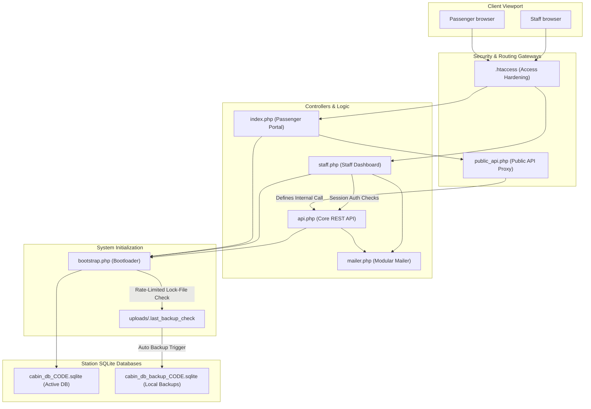
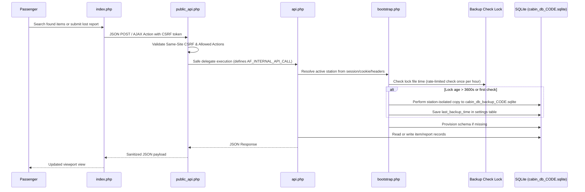
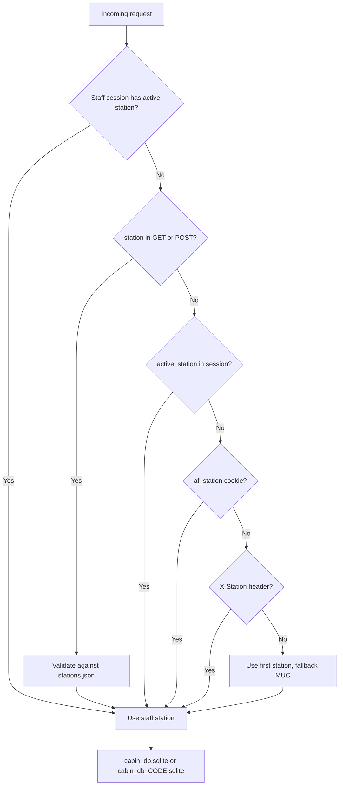
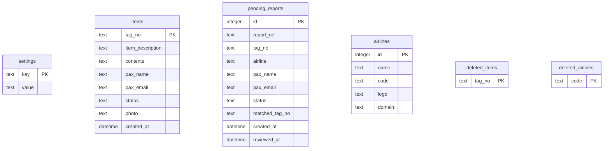

# Architecture

## Application Components

## Request Flow & Security Boundaries

## Station Resolution Flow

## Data Model

## Runtime Files & Storage Layout

- `cabin_db.sqlite` / `cabin_db_CODE.sqlite`: Active station database files (ignored by Git).
- `cabin_db_backup_CODE.sqlite`: Station-specific automated backup files, created via async background runners (ignored by Git).
- `uploads/`: Stores runtime attachments, image media, and local debug email copies.
- `uploads/.last_backup_check`: Lock-file to control the I/O rate-limiting of background backup checking (ensures runs occur at most once per hour).
- `release/`: Target directory for generated and compiled production releases. The obfuscated package is committed for automated updater installs; local secrets inside release output remain ignored.
- `uploads/.htaccess`: Security constraint file blocking code execution inside uploads directories.
